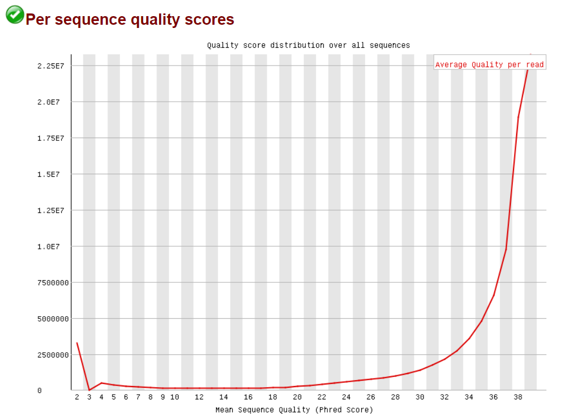

# hse_hw2_chip
## Ссылка на google collab 
## Была выбрана клеточная линия MCF-7, гистоновая метка H3K9me3, 
## FastQC 
### ENCFF656BIN

Подрезание для этой реплики не требуется
### ENCFF517BLK
До подрезания

После подрезания:

### ENCFF318ZNB - с контролем
До подрезания

После подрезания:

## Выравнивание на хромосоме
Таблица со статистикой:

Вероятно потому что мы выравниваем только по одной хромосоме
## Сравнение результатов

Пересечение считает число участков, которые имеются в первом файле, а также во втором. А соответсвенно при обратном наложении, наоброт те, которые есть во втором, а также в первом. Поэтому логично, что ответы разные.

